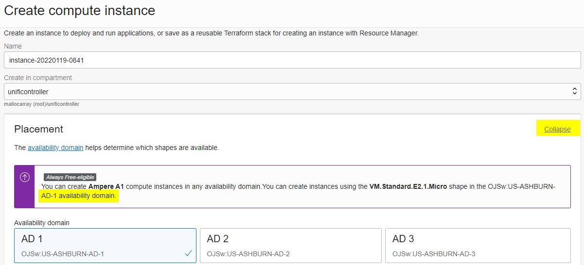
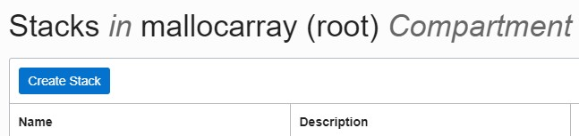

# Unifi Controller on Oracle Cloud Infrastructure for Free

Oracle Cloud Free Tier offer includes Always Free resources, such as 2 VMs with 1 CPU and 1 GB RAM each or Ampere ARM based VMs equivalent to 4 CPU and 24 GB RAM per month, which is sufficient to run a Unifi Controller for a small installation with no charge and no expiration date

[https://www.oracle.com/cloud/free/](https://www.oracle.com/cloud/free/)

Oracle uses "stacks" that automates the provisioning of an environment using Terraform.  Using only a single zip file, a Unifi Controller can be provisioned quickly with very little interaction.

## Breaking Changes

* The project name now only allows alphanumeric characters and no longer supports - or _.  This is due to enabling DNS on the VCN to allow for static IP assignment

## Configuration

1) Download the .zip file.
2) Register an account on Oracle Cloud.
   [https://myservices.us.oraclecloud.com/mycloud/signup](https://myservices.us.oraclecloud.com/mycloud/signup)
   * Recommended: Go to Menu>Compute>Instances>Create Instance. Click on "Edit" on the Placement panel and take note of the Availability domain number that is tagged with "Always Free Eligible". The process can then be cancelled. This number will be used later. (At this time, Ampere A1 can be created in any Availability Domain) 
3) Navigate to Menu>Storage>Object Storage & Archive>Buckets>Create Bucket. Give the bucket a name, such as "unifibackup". This will be used to store backup files outside of the VM Instance. Optional: Take note of the "Namespace: " value after creating the bucket as it will be used if mounting the bucket for autobackups.
4) Navigate to the Menu>Developer Services>Resource Manager>Stacks
5) Click "Create Stack"
   
6) Leave the default option of "My Configuration". Change the "Terraform configuration source" to ".Zip file", then drag or Browse the zip file to the Stack Configuration section. Provide a name for the stack if desired or keep the auto-generated name.  Leave the default Terraform version as 1.5.x then click Next 
7) Review the variables and modify if needed. Click Next, then Create
   * Enter/Verify the Availability Domain number in the list of variables.
   * Enter the name of the storage bucket created earlier
   * Defaults to an Ampere ARM based instance, or change to VM.Standard.E2.1.Micro for an Intel based instance with lower CPU/Memory allowance for Free Tier
8) On the final Create page, check the box to "Run Apply"
   * Alternatively, in the list of Stacks, click on the name of the newly created Stack.  Click on **Apply** followed by Apply.
9) In a few minutes, the Stacks job will complete and show the public IP address and URL to access the controller. It may take 15 minutes or more to complete the installation of the Unifi software.
   * If the process encounters an error stating "shape VM.Standard.E2.1.Micro not found", verify the Availability Domain that is Always Free Eligible for your region, or try a different number 1-3.
   * If the process encounters an error stating "Out of host capacity", your Region does not currently have available resources for Always Free instances. In the Oracle Forums regarding this error, they recommend trying again later as capacity is always being added.  You can also upgrade to "Pay As You Go" (PAYG) which makes the Ampere instances much more available, and as long as you stay under the Free Tier limits, continues to be free.
     [Managing Account Upgrades and Payment Method](https://docs.oracle.com/en-us/iaas/Content/Billing/Tasks/changingpaymentmethod.htm)
10) Open the URL to the controller web interface and configure or restore a backup file.  If using a DNS name, update the entry to reflect the new IP address.
11) Setup the controller or restore from a backup file

**Note**: When navigating around the Oracle interface, make sure to change the Compartment option on the left side to "unificontroller" or your Compartment name to view the newly created objects. To view the Stacks, change the Compartment back to root

## Information

The zip file contains one or more .TF files with Terraform instructions.  These configure the following:

* Container for all of the newly created objects
* Virtual Cloud Network
* Subnet
* Route Table
* Internet Gateway
* Network Security Groups with required ports for Unifi Controller
* Computer Instance sized for Always Free running Ubuntu 18.04 with public IP address
* iptables firewall rules added and saved for future reboots
* Packages updated on first boot and Unifi Controller installed using [GlennR&#39;s Installation Script](https://community.ui.com/questions/UniFi-Installation-Scripts-or-UniFi-Easy-Update-Script-or-Ubuntu-16-04-18-04-18-10-19-04-and-19-10-/ccbc7530-dd61-40a7-82ec-22b17f027776)

## SSH Access to Instance

To enable SSH to the Instance, follow the Oracle guide on [Managing Key Pair on Linux Instances](https://docs.cloud.oracle.com/iaas/Content/Compute/Tasks/managingkeypairs.htm?Highlight=ssh)

Paste the public key into the "ssh_public_key" variable when Applying the stack or modify and existing Instance under Resources>Console Connections

Additional information can be found on the Oracle Support Page under [Instance Console Connections](https://docs.cloud.oracle.com/iaas/Content/Compute/References/serialconsole.htm)

## Autobackup to storage Bucket

One method for retaining backup files is to mount the Oracle storage Bucket as the Unifi autobackup folder, so files are automatically copied to the Bucket, and upon recreation of the instance, the autobackup data is readily available.  Additional steps are needed ahead of time to support this:

### Creating a Customer Secret Key

To mount a bucket, a Customer Secret Key is needed.  To create one, in the Oracle OCI interface, click on the Profile icon in the upper right and select User Settings.  In the lower left under "Resources" click "Customer Secret Keys", then click "Generate Secret Key".  Give the key a name of your choosing and click "Generate Secret Key".  Copy the Generated Key and store it somewhere, as it will be added to the Stack Variables as "Customer Secret Key".  Close the popup window and also copy the "Access Key" value and store it somewhere as it will be added to the Stack Variables as "Customer Access Key".  Navigate to the Stack and edit the Variables to add these values and then Apply the Stack to recreate the instance.  If successful, the Unifi autobackup folder will now be the Bucket and files added to the folder are automatically stored in the Bucket outside of the Instance.

## Static IP Reservation

A static IP address can be reserved to keep the same address even if the original instance is deleted or recreated.  This is not done automatically by the Terraform file, but can configured after creation

1) Navigate to Menu>Compute>Instances and select the Unifi controller instance name. (Ensure Compartment on the left side is changed to "unificontroller")
2) Scroll down to "Attached VNICs" under Resources on the left side and click on the Primary VNIC name 
3) Scroll down to "IPv4 Addresses" under Resources on the left side and click the "..." icon to the far right and select Edit 
4) Change **Public IP Type** to "No Public IP" and click Update. Then click Edit again and select **Reserved Public IP** and "Create a New Reserved Public IP" or select a previously created entry. Click Update.

## Deleting or re-creating an instance

Instances created using Stacks can easily be destroyed to remove all associated items and optionally recreate them

1) Navigate to Menu>Resource Manager>Stacks and select the previously used Stack name
2) Select **Destroy**.  Confirm by clicking Destroy again. 

Once completed, return to Stacks to use the Apply option to create a new instance with the original configuration. It is not necessary to **Delete Stack** unless the stack configuration is changing.

**Note** If a Reserved IP address as assigned to the Instance, it will need to be removed from the VM prior to Destroying the stack. Since it was not created as part of the Stack, it will not be removed when Destroying the stack.

## Future To-Do List

* Incorporate some benefits of [GCP Unifi Controller Startup Script](https://metis.fi/en/2018/02/gcp-unifi-code/) created by PetriR to work with Ubuntu as an option.  Need to determine how much is applicable.

  * Fail2Ban
  * MongoDB Fix
  * Lighttpd
