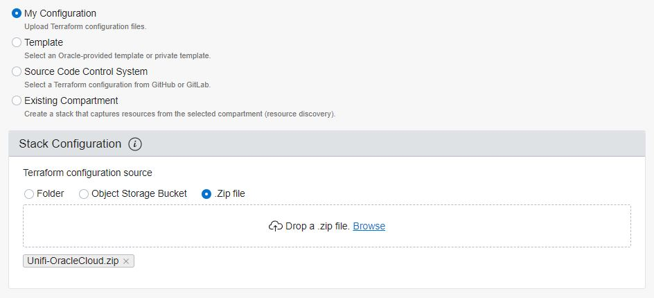
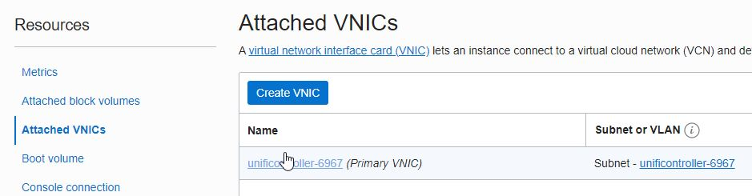
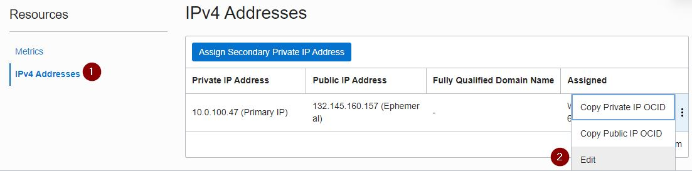

# Unifi Controller on Oracle Cloud Infrastructure for Free

Oracle Cloud Free Tier offer includes Always Free resources, such as 2 VMs with 1 CPU and 1 GB RAM each, which is sufficient to run a Unifi Controller for a small installation with no charge and no expiration date

https://www.oracle.com/cloud/free/

Oracle uses "stacks" that automates the provisioning of an environment using Terraform.  Using only a single zip file, a Unifi Controller can be provisioned quickly with very little interaction.

## Configuration
1) Download the .zip file.
2) Register an account on Oracle Cloud.
    https://myservices.us.oraclecloud.com/mycloud/signup
3) Once signed into Oracle Cloud, navigate to the Menu>Resource Manager>Stacks
4) Click "Create Stack"  
5) Drag or Browse the zip file to the Terraform Configuration section. Provide a name for the stack if desired or keep the auto-generated name.  Change the Terraform version to 0.12.x then click Next  
6) Review the variables and modify if needed. Click Next, then Create
7) In the list of Stacks, click on the name of the newly created Stack.  Click on **Terraform Actions** then **Apply** followed by Apply.
8) In a few minutes, the Stacks job will complete and show the public IP address and URL to access the controller. It may take 15 minutes or more to complete the installation of the Unifi software.
9) Open the URL to the controller web interface and configure or restore a backup file.  If using a DNS name, update the entry to reflect the new IP address.

**Note**: When navigating around the Oracle interface, make sure to change the Compartment option on the left side to "unificontroller" to view the newly created objects.

## Information
The zip file contains one or more .TF files with Terraform instructions.  These configure the following:
* Container for all of the newly created objects
* Virtual Cloud Network
* Subnet
* Route Table
* Internet Gateway
* Network Security Groups with required ports for Unifi Controller
* Computer Instance sized for Always Free running Ubuntu 16.04 with public IP address
* Packages updated on first boot and Unifi Controller installed using [GlennR's Installation Script](https://community.ui.com/questions/UniFi-Installation-Scripts-or-UniFi-Easy-Update-Script-or-Ubuntu-16-04-18-04-18-10-19-04-and-19-10-/ccbc7530-dd61-40a7-82ec-22b17f027776)

## Advanced Configuration
A static IP address can be reserved to keep the same address even if the original instance is deleted or recreated.  This is not done automatically by the Terraform file, but can configured after creation

1) Navigate to Menu>Instances and select the Unifi controller instance name. (Ensure Compartment on the left side is changed to "unificontroller")
2) Scroll down to "Attached VNICs" under Resources on the left side and click on the Primary VNIC name  
3) Scroll down to "IP Addresses" under Resources on the left side and click the "..." icon to the far right and select Edit  
4) Change **Public IP Type** to "No Public IP" and click Update. Then click Edit again and select **Reserved Public IP** and "Create a New Reserved Public IP" or select a previously created entry. Click Update.

## Deleting or re-creating an instance
Instances created using Stacks can easily be destroyed to remove all associated items and optionally recreate them
1) Navigate to Menu>Resource Manager>Stacks and select the previously used Stack name
2) Select **Terraform Actions** and Destroy.  Confirm by clicking Destroy again.   

Once completed, return to Stacks to use the Apply option to create a new instance with the original configuration. It is not necessary to **Delete Stack**

**Note** If a Reserved IP address as assigned to the Instance, it may need to be removed from the VM prior to Destroying the stack. Since it was not created as part of the Stack, it will not be removed when Destroying the stack.

# Future To-Do List
* Modify the [GCP Unifi Controller Startup Script](https://metis.fi/en/2018/02/gcp-unifi-code/) created by PetriR
    * ~~Support Oracle Cloud metadata~~ Completed
    * Support Ubuntu instead of Debian (Debian is not offered in Oracle)
    * Research simple way to copy backup files to Oracle Block Storage included in free tier
